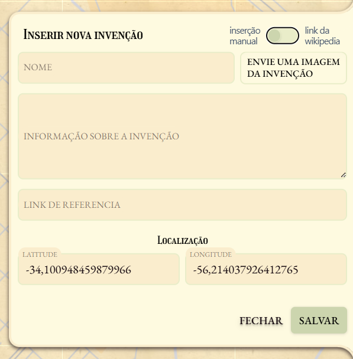
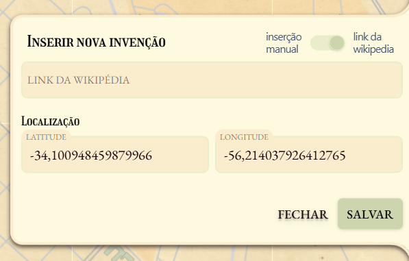

# Invention Mapper

Um mapa interativo mostrando em qual lugar do mundo invenções importantes foram criadas. Apesar do conceito besta a função deste projeto era estudar e praticar o uso de certas ferramentas, sendo elas: uma API construída em [Rust](https://www.rust-lang.org), a [API da Wikipedia](https://www.mediawiki.org/wiki/API:Main_page/pt-br) para coleta automática de dados, implementação de [Ollama](https://ollama.com) para resumir textos, um frontend construído usando [Astro](https://astro.build) e mapa feito através de [Leaflet](https://leafletjs.com).

## 🗺️ Sobre o Projeto

O **Invention Mapper** é uma aplicação web que permite visualizar e cadastrar invenções importantes em um mapa interativo do mundo. Cada invenção é representada por um marcador no mapa, mostrando onde ela foi criada ou demonstrada pela primeira vez.

### ✨ Funcionalidades Principais

- **Mapa Interativo**: Visualize invenções em um mapa mundial usando Leaflet
- **Cadastro Manual**: Adicione invenções manualmente com nome, descrição, imagem e coordenadas
- **Cadastro Automático**: Use links da Wikipedia para extrair automaticamente informações de invenções
- **IA Integrada**: Processamento inteligente de textos usando Ollama para resumir informações
- **Interface Moderna**: Frontend responsivo construído com Astro e TailwindCSS
- **API Robusta**: Backend em Rust com documentação automática via Swagger

### 🏗️ Arquitetura

O projeto é dividido em duas partes principais:

- **`server/`** - Backend em Rust com API REST, integração com IA e PostgreSQL
- **`web/`** - Frontend em Astro com mapa interativo e interface de usuário

### 📝 Como Adicionar Invenções

O sistema oferece duas formas de cadastrar novas invenções:

**Cadastro Manual**: Preencha todos os campos manualmente incluindo nome, descrição, imagem e coordenadas geográficas.

**Cadastro via Wikipedia**: Basta fornecer um link da Wikipedia e as coordenadas. O sistema extrai automaticamente as informações da página e usa IA para criar um resumo.

### 🛠️ Tecnologias Utilizadas

**Backend:**
- Rust com Actix Web
- PostgreSQL com SeaORM
- Ollama para processamento de IA
- Cloudinary para armazenamento de imagens
- Swagger para documentação da API

**Frontend:**
- Astro para construção da interface
- Leaflet para mapas interativos
- TailwindCSS para estilização
- Nanostores para gerenciamento de estado
- TypeScript para tipagem

### 📚 Documentação

Para informações técnicas detalhadas sobre como configurar e executar o projeto, consulte os READMEs específicos:
- [Documentação do Servidor](server/README.md)
- [Documentação do Frontend](web/README.md)